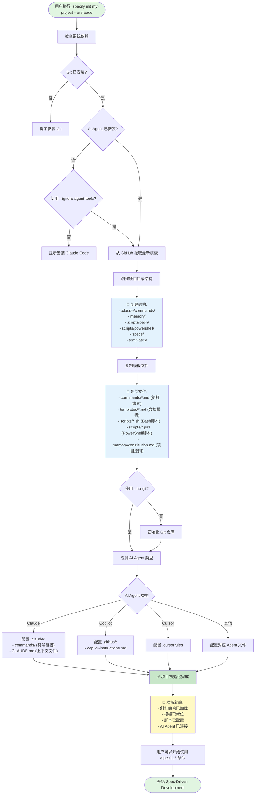

# Specify Init 完整流程图

> **核心概念**：用 Markdown 编程，让 AI 执行

## 流程总览



## 详细步骤说明

### 1️⃣ **依赖检查阶段**

```bash
# 检查必需工具
✓ Git (版本控制)
✓ Python 3.11+ (运行 specify CLI)
✓ uv (Python 包管理器)
✓ AI Agent (claude/copilot/cursor 等)
```

**目的**：确保所有必需工具已安装，避免后续执行失败。

---

### 2️⃣ **模板下载阶段**

```python
# 从 GitHub 仓库拉取最新模板
repository = "github/spec-kit"
branch = "main"
template_path = "templates/"

# 下载内容包括：
- 命令定义 (commands/*.md)
- 文档模板 (templates/*.md)
- 执行脚本 (scripts/bash/*.sh, scripts/powershell/*.ps1)
- 项目原则模板 (memory/constitution.md)
```

**关键点**：使用 GitHub API 确保获取最新版本，支持 `--github-token` 参数处理企业环境。

---

### 3️⃣ **目录结构创建**

生成的项目结构：

```
my-project/
├── .claude/                    # Claude Code 专属配置
│   └── commands/              # 斜杠命令（符号链接到 templates/commands/）
├── .github/                   # GitHub Copilot 配置
│   └── copilot-instructions.md
├── memory/                    # 项目记忆
│   └── constitution.md       # 项目原则（模板）
├── scripts/                   # 自动化脚本
│   ├── bash/                 # Linux/Mac 脚本
│   │   ├── check-prerequisites.sh
│   │   ├── create-new-feature.sh
│   │   ├── setup-plan.sh
│   │   └── update-agent-context.sh
│   └── powershell/           # Windows 脚本
│       ├── check-prerequisites.ps1
│       └── create-new-feature.ps1
├── specs/                     # 功能规格目录（初始为空）
└── templates/                 # 文档模板
    ├── commands/             # 命令定义（Markdown）
    │   ├── constitution.md
    │   ├── specify.md
    │   ├── plan.md
    │   ├── tasks.md
    │   └── implement.md
    ├── spec-template.md      # 规格文档模板
    ├── plan-template.md      # 计划文档模板
    └── tasks-template.md     # 任务文档模板
```

---

### 4️⃣ **AI Agent 集成**

根据 `--ai` 参数配置对应的 AI Agent：

#### **Claude Code** (`--ai claude`)

```bash
# 创建符号链接
ln -s ../../templates/commands .claude/commands

# 生成 .claude/CLAUDE.md（AI 上下文文件）
cat > .claude/CLAUDE.md << 'EOF'
# Project Context

This is a Spec-Driven Development project using Spec Kit.

## Available Commands
- /speckit.constitution - Create project principles
- /speckit.specify - Define feature requirements
- /speckit.plan - Create technical implementation plan
- /speckit.tasks - Generate task breakdown
- /speckit.implement - Execute implementation

## Workflow
1. Establish principles (/speckit.constitution)
2. Define requirements (/speckit.specify)
3. Clarify ambiguities (/speckit.clarify)
4. Plan implementation (/speckit.plan)
5. Generate tasks (/speckit.tasks)
6. Execute (/speckit.implement)
EOF
```

#### **GitHub Copilot** (`--ai copilot`)

```bash
# 创建 .github/copilot-instructions.md
cat > .github/copilot-instructions.md << 'EOF'
# Spec-Driven Development Instructions

This project uses Spec Kit for structured development.

Available slash commands:
- /speckit.constitution
- /speckit.specify
- /speckit.plan
...
EOF
```

---

### 5️⃣ **完成状态**

初始化完成后，项目处于 **就绪状态**：

```
✅ 项目初始化完成

📊 统计信息:
- 斜杠命令: 9 个
- 文档模板: 3 个
- 自动化脚本: 5 个
- AI Agent: Claude Code

🚀 下一步:
1. cd my-project
2. claude  (启动 Claude Code)
3. /speckit.constitution  (建立项目原则)
```

---

## 核心概念：Markdown 驱动

整个初始化过程的核心是：

```
┌─────────────────────────────────────┐
│  Markdown 文件（命令定义）          │
│  ↓                                   │
│  AI Agent 读取并理解                │
│  ↓                                   │
│  AI 执行 Outline 中的指令          │
│  ↓                                   │
│  生成代码/文档/配置                 │
└─────────────────────────────────────┘
```

**关键点**：
- ❌ 不是传统的代码生成工具
- ✅ 是基于 Markdown 的声明式编程
- ✅ AI 理解自然语言指令并执行
- ✅ 可扩展、可定制、可审计

---

## 实际执行示例

```bash
# 执行初始化
$ specify init todo-app --ai claude

🔍 检查依赖...
✓ Git 已安装 (v2.40.0)
✓ Python 已安装 (v3.11.5)
✓ Claude Code 已安装

📥 下载模板...
✓ 从 github/spec-kit 获取最新版本

📁 创建项目结构...
✓ 创建 .claude/commands/
✓ 创建 memory/
✓ 创建 scripts/
✓ 创建 specs/
✓ 创建 templates/

📝 配置 AI Agent...
✓ 创建 .claude/commands 符号链接
✓ 生成 .claude/CLAUDE.md
✓ 加载 9 个斜杠命令

🎉 初始化完成！

下一步:
  cd todo-app
  claude
  /speckit.constitution
```

---

## 与传统工具的对比

| 特性 | 传统脚手架工具 | Spec Kit |
|------|---------------|----------|
| 配置方式 | JSON/YAML 配置文件 | Markdown 文档 |
| 扩展方式 | 编写代码插件 | 编写 Markdown 指令 |
| 执行引擎 | 模板引擎 | AI 理解与执行 |
| 学习曲线 | 需要学习 API | 会写 Markdown 即可 |
| 灵活性 | 受限于预设选项 | AI 可以理解复杂需求 |

---

## 总结

`specify init` 的本质是：

1. **准备 Markdown 指令集**（命令文件）
2. **准备文档模板**（规格、计划、任务）
3. **连接 AI Agent**（让 AI 能读取指令）
4. **等待用户输入**（开始 Spec-Driven 流程）

整个过程 **不生成代码**，只是搭建一个 **AI 可以理解和执行的工作环境**。

真正的"编程"发生在用户使用 `/speckit.*` 命令时，AI 读取 Markdown 指令并执行！
