```mermaid
flowchart TD
    Input([用户输入: /speckit.constitution Create principles...]) --> ReadCmd[AI 读取 constitution.md 命令文件]

    ReadCmd --> ParseYAML["解析 YAML Front Matter:
    - description
    - handoffs"]

    ParseYAML --> ExtractArgs["提取用户参数:
    $ARGUMENTS = 'Create principles...'"]

    ExtractArgs --> ReadOutline[读取 Outline 指令]

    ReadOutline --> Step1["步骤1: 加载模板
    读取 /memory/constitution.md"]

    Step1 --> Template["模板内容:
    [PROJECT_NAME]
    [PRINCIPLE_1_NAME]
    [PRINCIPLE_1_DESC]
    ..."]

    Template --> Step2["步骤2: 识别占位符
    找到所有 [ALL_CAPS] 格式的占位符"]

    Step2 --> Step3["步骤3: 收集/推断值
    - 从用户输入提取
    - 从 README.md 推断
    - 从上下文推断"]

    Step3 --> AIFill["AI 填充内容:
    PROJECT_NAME = 'Todo App'
    PRINCIPLE_1_NAME = 'API-First'
    PRINCIPLE_1_DESC = 'All features must...'"]

    AIFill --> Step4["步骤4: 版本控制
    - 增加版本号
    - 记录修改日期
    - 生成变更报告"]

    Step4 --> Step5["步骤5: 一致性传播
    - 检查 spec-template.md
    - 检查 plan-template.md
    - 更新相关引用"]

    Step5 --> Validate["步骤6: 验证
    - 无未填充占位符
    - 版本号正确
    - 日期格式正确"]

    Validate --> Write["步骤7: 写回文件
    覆盖 /memory/constitution.md"]

    Write --> Report["步骤8: 生成报告
    ✅ Constitution v1.0.0 创建成功
    - 新增 3 个原则
    - 影响 2 个模板文件"]

    Report --> Handoff{"提供 handoff:
    下一步使用 /speckit.specify?"}

    Handoff -->|用户选择| NextCmd[跳转到 /speckit.specify]
    Handoff -->|用户拒绝| End([完成])

    style Input fill:#e1f5e1
    style AIFill fill:#fff9c4
    style Write fill:#c8e6c9
    style Report fill:#e3f2fd
```

```mermaid
flowchart TD
    Input([用户输入: /speckit.specify Build a todo app...]) --> ReadCmd[AI 读取 specify.md 命令文件]

    ReadCmd --> ParseYAML["解析 YAML:
    scripts:
      sh: create-new-feature.sh --json"]

    ParseYAML --> ExtractArgs["$ARGUMENTS = 'Build a todo app...'"]

    ExtractArgs --> Step1["步骤1: 生成短名称
    AI 分析描述 → 'todo-crud'"]

    Step1 --> Step2["步骤2: 检查已存在分支
    git fetch --all
    git ls-remote | grep 'todo-crud'"]

    Step2 --> CalcNumber["计算分支编号:
    - 查找最高编号: 0
    - 新编号: 001"]

    CalcNumber --> RunScript["步骤3: 执行 Bash 脚本
    ./scripts/bash/create-new-feature.sh \\
      --json \\
      --number 1 \\
      --short-name 'todo-crud' \\
      'Build a todo app...'"]

    RunScript --> ScriptOutput["脚本返回 JSON:
    {
      'BRANCH_NAME': '001-todo-crud',
      'SPEC_FILE': 'specs/001-todo-crud/spec.md',
      'FEATURE_DIR': 'specs/001-todo-crud'
    }"]

    ScriptOutput --> ScriptActions["脚本已完成:
    ✓ 创建分支 001-todo-crud
    ✓ 创建目录 specs/001-todo-crud/
    ✓ 从模板复制 spec.md"]

    ScriptActions --> Step4["步骤4: 加载模板
    读取 templates/spec-template.md"]

    Step4 --> Template["模板结构:
    # Feature Specification: [FEATURE NAME]
    ## User Scenarios
    - User Story 1: [...]
    ## Requirements
    - FR-001: [...]
    ## Success Criteria
    - [...]"]

    Template --> AIAnalysis["步骤5: AI 分析用户描述
    提取:
    - 用户角色: User
    - 核心动作: create, update, delete, list
    - 数据实体: Task
    - 约束条件: simple CRUD"]

    AIAnalysis --> AIFill["步骤6: AI 填充模板
    [FEATURE NAME] → 'Todo CRUD'
    User Story 1 → '用户创建任务'
    FR-001 → 'System MUST allow...'
    Success Criteria → 'Users can create...'"]

    AIFill --> CheckClarity{"步骤7: 检查清晰度
    是否有模糊需求?"}

    CheckClarity -->|有| AddMarkers["标记模糊点:
    FR-006: Tasks MUST have [NEEDS CLARIFICATION: priority levels?]"]

    CheckClarity -->|无| WriteSpec

    AddMarkers --> WriteSpec["步骤8: 写入文件
    写入 specs/001-todo-crud/spec.md"]

    WriteSpec --> Validation["步骤9: 质量验证
    创建 checklists/requirements.md
    - [ ] 无实现细节
    - [ ] 需求可测试
    - [ ] 成功标准可度量"]

    Validation --> CheckMarkers{"有 [NEEDS CLARIFICATION]?"}

    CheckMarkers -->|有| AskUser["步骤10: 向用户提问
    Q1: Should tasks have priority levels?
    Options:
    | A | Yes (High/Medium/Low) | ...
    | B | No (keep simple) | ..."]

    AskUser --> UserAnswer[用户回答: B]

    UserAnswer --> UpdateSpec["更新 spec.md:
    移除 [NEEDS CLARIFICATION]
    添加到 Clarifications 章节"]

    CheckMarkers -->|无| Report

    UpdateSpec --> Report["步骤11: 报告完成
    ✅ Spec 已创建
    - 分支: 001-todo-crud
    - 文件: specs/001-todo-crud/spec.md
    - 用户故事: 4 个
    - 需求: 12 个"]

    Report --> Handoff{"Handoff:
    - 使用 /speckit.clarify 澄清
    - 使用 /speckit.plan 规划"}

    Handoff --> End([完成])

    style Input fill:#e1f5e1
    style RunScript fill:#fce4ec
    style AIFill fill:#fff9c4
    style WriteSpec fill:#c8e6c9
    style Report fill:#e3f2fd
```

# Spec Kit 命令执行流程详解

> **核心概念**：Markdown 即代码，AI 即执行器

## 总体工作流程


---

## 1. `/speckit.constitution` - 建立项目原则

### 执行流程



### Markdown 编程示例

**命令文件片段** (`constitution.md`):

```markdown
## Outline

1. Load the existing constitution template at `/memory/constitution.md`.
   - Identify every placeholder token of the form `[ALL_CAPS_IDENTIFIER]`.

2. Collect/derive values for placeholders:
   - If user input supplies a value, use it.
   - Otherwise infer from README, docs, prior versions.

3. Draft the updated constitution content:
   - Replace every placeholder with concrete text.
   - Ensure each Principle section has: name, description, rationale.

4. Write the completed constitution back to `/memory/constitution.md`.
```

**关键点**：
- ✅ 纯自然语言指令
- ✅ AI 理解"Load"、"Identify"、"Replace"等动词
- ✅ AI 知道如何操作文件

---

## 2. `/speckit.specify` - 定义功能需求

### 执行流程



### Markdown 编程示例

**命令文件片段** (`specify.md`):

```markdown
## Outline

1. **Generate a concise short name** (2-4 words):
   - Analyze the feature description
   - Extract meaningful keywords
   - Create action-noun format (e.g., "add-user-auth")

2. **Check for existing branches**:
   - Fetch remote: `git fetch --all --prune`
   - Find highest number: `git ls-remote --heads origin | grep 'short-name'`
   - Calculate next number: N+1

3. **Run the script**: `{SCRIPT} --json --number N+1 --short-name "name"`

4. **Fill specification** using template structure

5. **Quality validation**: Check for implementation details, testability
```

**脚本调用机制**：

```yaml
scripts:
  sh: scripts/bash/create-new-feature.sh --json "{ARGS}"
  ps: scripts/powershell/create-new-feature.ps1 -Json "{ARGS}"
```

AI 看到 `{SCRIPT}` 时，会根据操作系统选择执行 `sh` 或 `ps` 版本。

---

## 3. `/speckit.clarify` - 澄清模糊需求

### 执行流程



```mermaid
flowchart TD
    Input([用户输入: /speckit.clarify]) --> ReadCmd[AI 读取 clarify.md]

    ReadCmd --> RunScript["执行前置脚本:
    check-prerequisites.sh --json --paths-only"]

    RunScript --> GetPaths["获取路径:
    FEATURE_DIR = 'specs/001-todo-crud'
    FEATURE_SPEC = '...specs/001-todo-crud/spec.md'"]

    GetPaths --> LoadSpec[加载 spec.md 文件]

    LoadSpec --> Scan["扫描模糊点（使用分类法）:
    - Functional Scope ✓
    - Data Model ⚠️
    - UX Flow ✓
    - Non-Functional ✗
    - Edge Cases ✗"]

    Scan --> Prioritize["优先级排序:
    1. Security (HIGH)
    2. Edge Cases (HIGH)
    3. Non-Functional (MEDIUM)
    4. Data Volume (LOW)"]

    Prioritize --> GenQuestions["生成问题（最多5个）:
    Q1: Performance targets?
    Q2: Error handling for API failures?
    Q3: Data retention period?"]

    GenQuestions --> AskQ1["向用户提问 Q1:
    **Recommended:** Option A - 95th percentile < 100ms

    | Option | Description |
    |--------|-------------|
    | A | 95th percentile < 100ms |
    | B | Median < 50ms |
    | C | No specific target |

    Reply with option letter or 'yes' for recommendation"]

    AskQ1 --> UserA1[用户回答: yes]

    UserA1 --> IntegrateA1["立即整合答案:
    1. 添加到 Clarifications:
       - Q: Performance? → A: 95th < 100ms
    2. 更新 Non-Functional Requirements:
       - NFR-001: 95th percentile < 100ms"]

    IntegrateA1 --> WriteSpec1[保存 spec.md]

    WriteSpec1 --> AskQ2["向用户提问 Q2:
    **Suggested:** Retry 3 times with exponential backoff

    Accept suggestion ('yes') or provide your answer (<= 5 words)"]

    AskQ2 --> UserA2[用户: yes]

    UserA2 --> IntegrateA2["立即整合答案:
    - 添加到 Clarifications
    - 更新 Edge Cases 章节"]

    IntegrateA2 --> WriteSpec2[保存 spec.md]

    WriteSpec2 --> CheckDone{"问题全部回答
    或用户说 'done'?"}

    CheckDone -->|否| AskQ3[继续下一个问题]
    AskQ3 --> UserA3[用户回答]
    UserA3 --> IntegrateA3[整合并保存]
    IntegrateA3 --> CheckDone

    CheckDone -->|是| FinalValidation["最终验证:
    - 无遗留 [NEEDS CLARIFICATION]
    - 术语一致性
    - 无矛盾声明"]

    FinalValidation --> Report["生成覆盖率报告:
    | Category | Status |
    |----------|--------|
    | Functional | Clear ✓ |
    | Data Model | Resolved ✓ |
    | Non-Functional | Resolved ✓ |
    | Edge Cases | Resolved ✓ |

    ✅ 回答了 3 个问题
    ✅ 更新了 4 个章节"]

    Report --> Handoff["Handoff:
    建议使用 /speckit.plan"]

    Handoff --> End([完成])

    style Input fill:#e1f5e1
    style AskQ1 fill:#fff9c4
    style IntegrateA1 fill:#e3f2fd
    style WriteSpec1 fill:#c8e6c9
    style Report fill:#e3f2fd
```

### Markdown 编程关键点

**增量更新策略** - 命令文件片段：

```markdown
5. Integration after EACH accepted answer (incremental update):
   - Maintain in-memory representation of the spec
   - For the first answer:
     - Ensure `## Clarifications` section exists
     - Create `### Session YYYY-MM-DD` subheading
   - Append bullet: `- Q: <question> → A: <answer>`
   - Apply clarification to appropriate section
   - **Save the spec file AFTER each integration**
```

**为什么是增量更新？**
- ✅ 防止上下文丢失
- ✅ 用户可以随时停止
- ✅ 每次保存都是原子操作

---

## 4. `/speckit.plan` - 创建技术方案

### 执行流程



```mermaid
flowchart TD
    Input([用户输入: /speckit.plan Use Node.js, Express, PostgreSQL...]) --> ReadCmd[AI 读取 plan.md]

    ReadCmd --> RunScript["执行脚本:
    setup-plan.sh --json"]

    RunScript --> GetContext["获取上下文:
    FEATURE_SPEC = 'specs/001-todo-crud/spec.md'
    IMPL_PLAN = 'specs/001-todo-crud/plan.md'
    SPECS_DIR = 'specs/001-todo-crud'"]

    GetContext --> LoadFiles["加载文件:
    - spec.md (功能需求)
    - /memory/constitution.md (项目原则)
    - plan-template.md (计划模板)"]

    LoadFiles --> Phase0["Phase 0: 研究阶段
    识别技术栈未知点"]

    Phase0 --> FindUnknowns["查找 NEEDS CLARIFICATION:
    - PostgreSQL 版本选择?
    - Express 中间件最佳实践?
    - 数据库连接池配置?"]

    FindUnknowns --> ParallelResearch["并行启动研究任务:
    Task 1: 研究 PostgreSQL 14 vs 15
    Task 2: 研究 Express 安全中间件
    Task 3: 研究 pg 连接池配置"]

    ParallelResearch --> ResearchDone["研究完成，生成 research.md:
    ## PostgreSQL Version
    Decision: PostgreSQL 15
    Rationale: Performance improvements...

    ## Express Middleware
    Decision: helmet, cors, express-rate-limit
    Rationale: Security best practices..."]

    ResearchDone --> Phase1["Phase 1: 设计阶段"]

    Phase1 --> ExtractEntities["从 spec.md 提取实体:
    - Task (id, title, completed, due_date)
    - User (id, email, name)"]

    ExtractEntities --> GenDataModel["生成 data-model.md:
    ## Entities

    ### Task
    - id: UUID (PK)
    - title: VARCHAR(255)
    - completed: BOOLEAN
    - due_date: TIMESTAMP
    - user_id: UUID (FK → User)

    ### Relationships
    - User 1-to-Many Task"]

    GenDataModel --> GenContracts["生成 API 契约:
    contracts/api-spec.json:
    {
      'POST /tasks': {
        'request': { 'title': 'string', ... },
        'response': { 'id': 'uuid', ... }
      },
      'GET /tasks': { ... }
    }"]

    GenContracts --> GenQuickstart["生成 quickstart.md:
    # Quick Start

    1. npm install
    2. docker-compose up -d
    3. npm run migrate
    4. npm run dev"]

    GenQuickstart --> UpdateAgent["更新 AI Agent 上下文:
    执行 update-agent-context.sh claude

    更新 .claude/CLAUDE.md:
    ## Tech Stack
    - Node.js 18+
    - Express 4.18
    - PostgreSQL 15
    - Sequelize ORM"]

    UpdateAgent --> ConstitutionCheck["宪法检查:
    验证计划是否符合项目原则
    - ✓ API-First (有 API 契约)
    - ✓ Test-Driven (计划包含测试)
    - ✓ Performance (定义了性能目标)"]

    ConstitutionCheck --> WriteAll["写入所有文件:
    ✓ plan.md
    ✓ research.md
    ✓ data-model.md
    ✓ contracts/api-spec.json
    ✓ quickstart.md"]

    WriteAll --> Report["报告完成:
    ✅ 技术计划已创建
    - 技术栈: Node.js + Express + PostgreSQL
    - 实体: 2 个
    - API 端点: 5 个
    - 研究主题: 3 个"]

    Report --> Handoff["Handoff:
    使用 /speckit.tasks 生成任务"]

    Handoff --> End([完成])

    style Input fill:#e1f5e1
    style ParallelResearch fill:#fce4ec
    style GenDataModel fill:#fff9c4
    style GenContracts fill:#e3f2fd
    style UpdateAgent fill:#f3e5f5
    style Report fill:#c8e6c9
```

### Markdown 编程：并行任务

**命令文件片段**：

```markdown
2. **Generate and dispatch research agents**:

   For each unknown in Technical Context:
     Task: "Research {unknown} for {feature context}"
   For each technology choice:
     Task: "Find best practices for {tech} in {domain}"
```

AI 理解这段指令后：
1. 识别出需要多个研究任务
2. 使用 Task tool 并行启动多个 agents
3. 等待所有结果返回
4. 整合到 research.md

**这就是"Markdown 编程"的威力**：用自然语言描述并行策略，AI 负责执行！

---

## 5. `/speckit.tasks` - 生成任务分解

### 执行流程



```mermaid
flowchart TD
    Input([用户输入: /speckit.tasks]) --> ReadCmd[AI 读取 tasks.md 命令文件]

    ReadCmd --> RunScript["执行脚本:
    check-prerequisites.sh --json"]

    RunScript --> LoadContext["加载上下文:
    - spec.md (用户故事)
    - plan.md (技术方案)
    - data-model.md (数据模型)
    - contracts/ (API 契约)"]

    LoadContext --> ParseStories["解析用户故事:
    - Story 1: Create Task (P1)
    - Story 2: List Tasks (P2)
    - Story 3: Update Task (P3)
    - Story 4: Delete Task (P4)"]

    ParseStories --> GenPhases["为每个故事生成阶段:

    Story 1 (P1) - Create Task:
    ├── Phase 1.1: Setup
    ├── Phase 1.2: Database
    ├── Phase 1.3: API
    └── Phase 1.4: Tests"]

    GenPhases --> GenTasks["生成任务（自下而上）:

    Phase 1.1: Setup
    - [P] Task 1.1.1: npm init + dependencies
    - [P] Task 1.1.2: 配置 ESLint/Prettier
    - Task 1.1.3: 配置 .env

    Phase 1.2: Database
    - Task 1.2.1: 创建 Task 模型 (models/task.js)
    - Task 1.2.2: 创建迁移 (migrations/001_create_tasks.js)
    - Task 1.2.3: 运行迁移

    Phase 1.3: API
    - Task 1.3.1: 实现 POST /tasks (routes/tasks.js)
    - Task 1.3.2: 添加验证中间件

    Phase 1.4: Tests
    - Task 1.4.1: 编写 POST /tasks 测试
    - Task 1.4.2: 运行测试并验证"]

    GenTasks --> MarkParallel["标记可并行任务:
    - [P] 表示可以并行执行
    - 无 [P] 表示必须顺序执行

    规则:
    - 不同文件 → 可并行
    - 有依赖关系 → 必须顺序
    - Setup 任务 → 可并行"]

    MarkParallel --> AddPaths["为每个任务添加文件路径:
    Task 1.2.1: models/task.js
    Task 1.2.2: migrations/001_create_tasks.js
    Task 1.3.1: routes/tasks.js"]

    AddPaths --> TDD["应用 TDD 原则:
    如果用户要求测试:
    - 先写测试任务
    - 再写实现任务

    Task 1.4.1: 编写测试 ← 先
    Task 1.3.1: 实现 API ← 后"]

    TDD --> Checkpoints["添加检查点:
    每个用户故事后:

    ✓ Checkpoint 1.x: 验证 Story 1 独立可测
      - 运行 npm test
      - 测试 POST /tasks 端点
      - 验证数据库写入"]

    Checkpoints --> GenTemplate["使用 tasks-template.md 格式:
    # Implementation Tasks

    ## Phase 1: Story 1 - Create Task (P1)

    ### Setup
    - [ ] Task 1.1.1: Initialize project [P]
    - [ ] Task 1.1.2: Configure tooling [P]

    ### Database
    - [ ] Task 1.2.1: Create Task model
    ..."]

    GenTemplate --> WriteTasks["写入 tasks.md"]

    WriteTasks --> Report["报告完成:
    ✅ 任务分解已生成
    - 用户故事: 4 个
    - 总任务: 32 个
    - 可并行: 8 个
    - 检查点: 4 个

    文件: specs/001-todo-crud/tasks.md"]

    Report --> Handoff["Handoff:
    - 使用 /speckit.analyze 分析
    - 使用 /speckit.implement 实现"]

    Handoff --> End([完成])

    style Input fill:#e1f5e1
    style GenTasks fill:#fff9c4
    style MarkParallel fill:#fce4ec
    style TDD fill:#e3f2fd
    style WriteTasks fill:#c8e6c9
    style Report fill:#f3e5f5
```

### Markdown 编程：依赖管理

**命令文件片段**：

```markdown
## Task Ordering Rules

1. **Respect dependencies**:
   - Database models BEFORE services
   - Services BEFORE endpoints
   - Tests BEFORE implementation (if TDD)

2. **Mark parallel tasks**:
   - Different files → [P]
   - No shared state → [P]
   - Setup/config → [P]

3. **File path tracking**:
   - Each task MUST specify target file
   - Used for conflict detection
```

AI 理解这些规则后，自动：
- ✅ 识别依赖关系
- ✅ 标记可并行任务
- ✅ 确保正确的执行顺序

---

## 6. `/speckit.implement` - 执行实现

### 执行流程



```mermaid
flowchart TD
    Input([用户输入: /speckit.implement]) --> ReadCmd[AI 读取 implement.md]

    ReadCmd --> RunScript["执行脚本:
    check-prerequisites.sh --json --require-tasks"]

    RunScript --> CheckChecklists{"检查 checklists/"}

    CheckChecklists -->|存在| ScanChecklists["扫描所有 checklist 文件:
    | Checklist | Total | Done | Status |
    |-----------|-------|------|--------|
    | ux.md | 12 | 12 | ✓ PASS |
    | api.md | 8 | 5 | ✗ FAIL |"]

    ScanChecklists --> AllComplete{所有 checklist 完成?}

    AllComplete -->|否| AskProceed["询问用户:
    ⚠️ 有 3 个 checklist 项未完成
    是否继续实现? (yes/no)"]

    AskProceed -->|no| End1([停止])
    AskProceed -->|yes| LoadContext

    AllComplete -->|是| ShowPass["显示:
    ✅ 所有 checklist 通过"]

    CheckChecklists -->|不存在| LoadContext

    ShowPass --> LoadContext["加载实现上下文:
    - tasks.md (任务列表)
    - plan.md (技术方案)
    - data-model.md (数据模型)
    - contracts/ (API 契约)"]

    LoadContext --> SetupIgnore["项目设置:
    检测技术栈 → Node.js
    创建/验证 .gitignore:
    - node_modules/
    - dist/
    - .env"]

    SetupIgnore --> ParseTasks["解析 tasks.md:
    提取:
    - 阶段结构
    - 任务 ID
    - [P] 并行标记
    - 文件路径
    - 依赖关系"]

    ParseTasks --> TaskList["任务列表:
    Phase 1.1: Setup
      [P] 1.1.1: npm init
      [P] 1.1.2: ESLint
      1.1.3: .env
    Phase 1.2: Database
      1.2.1: Task model
      1.2.2: Migration
      ..."]

    TaskList --> ExecPhase1["执行 Phase 1.1 (Setup):
    并行执行 [P] 任务:
    - 运行: npm init -y
    - 运行: npm install express pg
    - 运行: npx eslint --init
    顺序执行:
    - 创建 .env 文件"]

    ExecPhase1 --> Mark1["标记完成:
    更新 tasks.md:
    - [X] 1.1.1: npm init
    - [X] 1.1.2: ESLint
    - [X] 1.1.3: .env"]

    Mark1 --> Progress1["报告进度:
    ✅ Phase 1.1 完成 (3/3)
    总进度: 3/32 (9%)"]

    Progress1 --> ExecPhase2["执行 Phase 1.2 (Database):
    顺序执行:
    1. 创建 models/task.js
    2. 创建 migrations/001_create_tasks.js
    3. 运行: npm run migrate"]

    ExecPhase2 --> CheckError{执行出错?}

    CheckError -->|是| HandleError["错误处理:
    ❌ Task 1.2.2 失败: 迁移文件语法错误

    停止执行
    显示错误上下文
    建议修复方案"]

    HandleError --> End2([停止并等待用户修复])

    CheckError -->|否| Mark2["标记完成并更新 tasks.md"]

    Mark2 --> Progress2["报告进度:
    ✅ Phase 1.2 完成 (3/3)
    总进度: 6/32 (19%)"]

    Progress2 --> ExecPhase3["执行 Phase 1.3 (API):
    1. 创建 routes/tasks.js
    2. 实现 POST /tasks
    3. 添加验证中间件"]

    ExecPhase3 --> Mark3[标记完成]

    Mark3 --> ExecPhase4["执行 Phase 1.4 (Tests):
    1. 创建 tests/tasks.test.js
    2. 运行: npm test"]

    ExecPhase4 --> TestResult{测试通过?}

    TestResult -->|否| FixTests["修复测试:
    分析失败原因
    更新代码
    重新运行测试"]

    FixTests --> TestResult

    TestResult -->|是| Checkpoint["✓ Checkpoint 1: Story 1 验证
    - 测试通过: 5/5
    - API 可用: POST /tasks
    - 数据库写入正常"]

    Checkpoint --> NextStory{还有其他故事?}

    NextStory -->|是| ExecStory2["执行 Story 2 (List Tasks)
    重复 Setup → Database → API → Tests"]

    ExecStory2 --> Checkpoint2[Checkpoint 2]
    Checkpoint2 --> NextStory

    NextStory -->|否| FinalValidation["最终验证:
    - 所有任务完成: 32/32
    - 所有测试通过
    - 所有 checkpoints 通过
    - 功能符合 spec.md"]

    FinalValidation --> FinalReport["生成完成报告:
    ✅ 实现完成

    📊 统计:
    - 用户故事: 4/4 完成
    - 任务: 32/32 完成
    - 测试: 20/20 通过
    - 代码覆盖率: 87%

    📁 创建的文件:
    - models/: 2 个
    - routes/: 4 个
    - tests/: 4 个
    - migrations/: 4 个"]

    FinalReport --> End([完成])

    style Input fill:#e1f5e1
    style ExecPhase1 fill:#fff9c4
    style Mark1 fill:#c8e6c9
    style Progress1 fill:#e3f2fd
    style Checkpoint fill:#f3e5f5
    style FinalReport fill:#c8e6c9
```

### Markdown 编程：错误恢复

**命令文件片段**：

```markdown
8. Progress tracking and error handling:
   - Report progress after each completed task
   - **Halt execution if any non-parallel task fails**
   - For parallel tasks [P], continue with successful tasks, report failed ones
   - Provide clear error messages with context for debugging
   - Suggest next steps if implementation cannot proceed
   - **IMPORTANT**: Mark completed tasks as [X] in tasks.md
```

AI 理解这段指令后：
- ✅ 自动追踪进度
- ✅ 识别并行 vs 顺序任务的错误处理
- ✅ 提供调试上下文
- ✅ 更新任务状态

---

## 核心概念总结：Markdown 即代码

### 传统编程 vs Markdown 编程

| 维度 | 传统编程 | Markdown 编程 (Spec Kit) |
|------|---------|------------------------|
| **语言** | Python, JavaScript, etc. | 自然语言 Markdown |
| **执行器** | 解释器/编译器 | AI (Claude, GPT, etc.) |
| **控制流** | if/for/while | 自然语言描述逻辑 |
| **函数调用** | `function()` | `{SCRIPT}` 或指令描述 |
| **变量** | `var x = 1` | `$ARGUMENTS`, JSON 路径 |
| **并行** | `Promise.all()`, `async/await` | "并行启动研究任务" |
| **错误处理** | `try/catch` | "如果失败，报告错误并停止" |
| **文件操作** | `fs.readFile()` | "读取 spec.md" |
| **调试** | 断点、日志 | AI 理解上下文并解释 |

### 关键优势

1. **可读性**：任何人都能读懂 Markdown 命令
2. **可维护性**：修改指令就是编辑 Markdown
3. **可扩展性**：添加新命令 = 创建新 .md 文件
4. **智能化**：AI 处理边界情况和模糊需求

### 执行模型

```
┌────────────────────────────────────────────┐
│  Markdown 命令文件                          │
│  ├── YAML: 元数据                           │
│  ├── $ARGUMENTS: 用户输入                   │
│  └── Outline: 执行步骤                      │
└────────────────────────────────────────────┘
                   ↓
        AI Agent 解析并理解
                   ↓
┌────────────────────────────────────────────┐
│  执行引擎 (AI)                              │
│  ├── 调用脚本 ({SCRIPT})                    │
│  ├── 读写文件 (spec.md, plan.md, etc.)     │
│  ├── 并行任务 (Task tool)                   │
│  ├── 用户交互 (提问、确认)                   │
│  └── 生成内容 (填充模板)                     │
└────────────────────────────────────────────┘
                   ↓
┌────────────────────────────────────────────┐
│  输出结果                                   │
│  ├── 更新的文件                             │
│  ├── 执行报告                               │
│  └── Handoff 建议                           │
└────────────────────────────────────────────┘
```

---

## 下一步

阅读 **[Markdown 编程实战指南](./flow-3-markdown-programming-guide.md)** 学习如何创建自己的命令！
